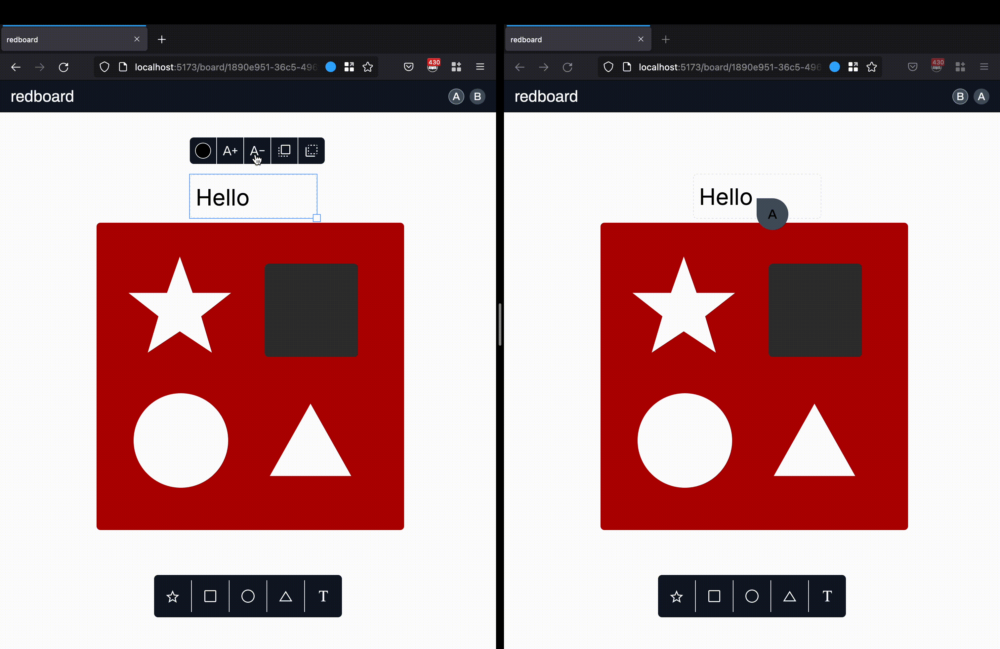
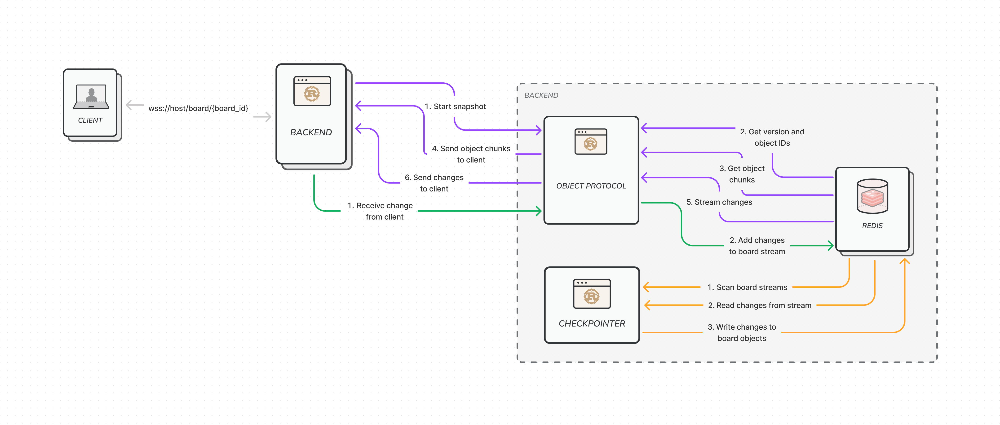
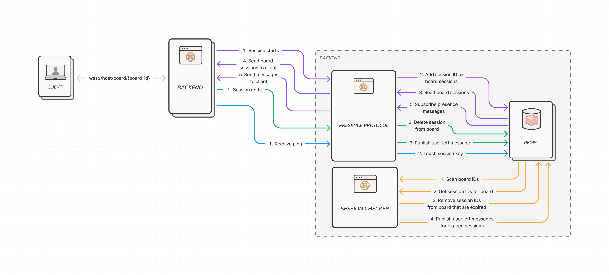

# RedBoard

A collaborative whiteboard driven by Redis, inspired by Figma. Please see my
[submission post](https://dev.to/lukewestby/redboard-a-collaborative-whiteboard-driven-by-redis-1f)
for an explanation of my goals and inspiration for this project.



## How it works

The backend application is essentially a very simple, generic real-time JSON store. It allows
multiple clients to modify a group JSON by ID such that the last write received by the server always
wins, and all clients are incrementally notified of the correct state of the objects. The visual
functionality of the end-user application is built on top of this store, but the store knows nothing
about the meaning of the objects that it stores.

Some important terms:

- Board: a collection of viewable objects that many people can edit at once
- Object: an individual visual item in a board
- Change: a structured representation of an edit for an object
  - `{ type: "Insert", id: "<UUID>", "object": { "property1": "hello", ... } }`
  - `{ type: "Update", "id": "<UUID>", "key": "property1", value: "world" }`
  - `{ type: "Delete", "id": "<UUID>" }`
- Session: an open connection between a browser and the backend for a particular board

The primary use case for the backend is the _object protocol_, the processes that handle changes to
objects and serve their contents to clients. The protocol occurs in two phases: snapshot and
streaming. During the snapshot the backend reads the latest contents of a board from a fully
materialized set of objects in Redis and sends them to the client in chunks. Once that is complete
changes are streamed to the client starting from the last known change _before_ the snapshot began,
to ensure no data is missed. There is also a background process that keeps each snapshot up to date
to make both phases fast.



The secondary use case for the backend is the _presence protocol_, which tracks the presence and
cursor position of all connected clients and broadcasts them to everyone else. There is also a
background process that collects expired sessions that may have been disconnected in an unusual way.
This secondary feature adds a little bit of extra flourish to the app and also helps to
contextualize for the user any changes that show up on the screen because of other users.



### How the data is stored:

#### Board

- All of the latest objects in a board are stored at `board/{board_id}/objects`. This entry
  contains a JSON value consisting of a JSON object where every key is the UUID of an object, and
  the value is yet another JSON object containing the properties of that object
  ```
  {
    "<UUID>": {
      "property1": "hello world",
      "property2": false,
      "property3": 1
    }
  }
  ```
- Any changes to objects that are received from clients are added to a stream at
  `board/{board_id}/changes`. A background process SCANs all of these keys and pulls the latest
  entries off of the stream. Each entry is converted into a single `JSON.*` command and appended
  a pipeline of commands that is applied atomically using MULTI/EXEC. The last entry ID from the
  stream is saved to `board/{board_id}/version`. All stream entries prior to that last ID are then
  purged as they have been successfully checkpointed into `board/{board_id}/objects` and are no
  longer required to recover the latest state of the board.
- The ID of the stream entry most recently applied to the contents of `board/{board_id}/objects`
  is stored at `board/{board_id}/version`

#### Sessions and presence

- The existence of a session is expressed through a simple entry at
  `session/{session_id}/checkin`. This key contains an arbitrary number, for the real information
  it carries is the expiration on the key. Connections must check in about every 30 seconds or
  else the key expires and any other data related to the session will be cleaned up by a
  background process.
- Sessions connected to a board are tracked in a set at `board/{board_id}/sessions`. When a
  session joins a board its UUID is added to the set. It is removed from the set when the socket
  connection disconnects or when a background process discovers that its checkin has expired.
- Any updates pertaining to a session within a given board are published to a channel at
  `board/{board_id}/presence`. These data include messages about the position of the user's cursor
  as well as notifications for when a session joins or leaves. Only 1000 messages are retained in
  memory because they are ephemeral and not critical for consistency of the board's objects.

### How the data is accessed:

#### Opening a board

When a session first joins a board it must snapshot all of the latest data for the board. It first
retrieves the value of `board/{board_id}/version`. It then retrieves all of the keys in the JSON
object at `board/{board_id}/objects` using `JSON.KEYS`. It then splits the keys into chunks of 1000,
fetches them with `JSON.GET`, and sends those chunks to the client until it runs out of keys.
At this point the process for the session starts streaming entries from `board/{board_id}/changes`.

#### Sending realtime changes

Once a client has received everything from `board/{board_id}/objects` it starts streaming from
`board/{board_id}/changes`. Reading begins at whatever was in `board/{board_id}/version` prior to
reading the object snapshot, so no changes are missed if they occur between when the session
connected and when the data was fully sent to the client. Each change includes both the change
itself at the `change` key (`{ "type": "Insert", ... }`, etc.) and the UUID of the session that sent
it in the `session_id` key. This allows the client to properly handle its own changes when they are
reflected back from the server.

#### Presence

A background task PSUBSCRIBES to `board/*/presence` and pushes any messages received onto a `tokio`
broadcast channel. When a session connects it reads messages from the channel, ignoring
messages that are for itself or for a different board. The broadcast channel only holds 1000
messages at a time, but dropping messages is acceptable because presence messages are ephemeral and
not critical to data consistency.

## How to run it locally?

### Prerequisites

To run with docker compose you need only install the latest Docker CE. If you want to compile and
run natively you will need a running Redis server, Node 16, and the Rust toolchain for v1.63.

### Local installation

The whole application can be started with docker compose. This will probably take a couple of
minutes to build. Classic Rust, am I right folks?

```
docker compose up
```

You can also build it natively by compiling the frontend to static files and then compiling and
running the backend. Before you do, make sure that the `REDIS_URL` env var is set! You can use a
.env file or just set it directly in your terminal.

```
yarn install
yarn build
REDIS_URL=redis://whatever cargo run
```

In either case, open up to http://localhost:1234

## Deployment

To make deploys work, you need to create free account on [Redis Cloud](https://redis.info/try-free-dev-to)

### Google Cloud Run

> This doesn't work yet, still figuring out why

[](https://deploy.cloud.run/?git_repo=https://github.com/lukewestby/redboard.git)

### Render

[](https://render.com/deploy)
